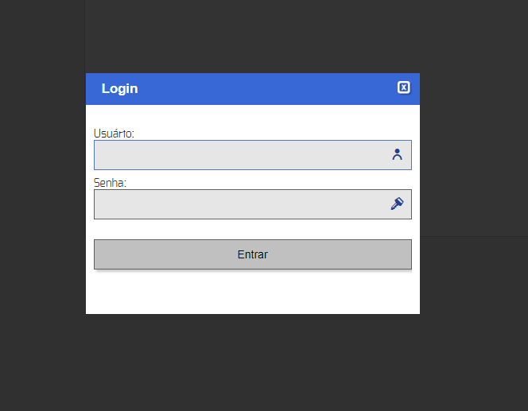
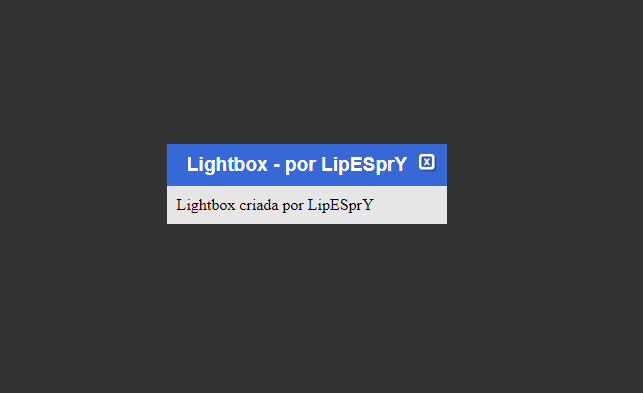

# lsi-lightbox-modal
Lightbox com opção de exibir conteúdo recebido via requisição ajax e com dimensionamento automático, conforme conteúdo carregado.

## Uso:
1) Carregar o script e a folha de estilos da Lightbox na raiz do HTML:
```
<script type="text/javascript" src="lightbox/script.js"></script>
<link rel="stylesheet" type="text/css" href="lightbox/estilo.css">
```

2) Adicionar a base da Lightbox na raiz do HTML:

```
<div class="lightbox-bg" id="lsi_lightbox">
	<div class="lightbox">
		<div class="cabecalho">
			<span>Lightbox - por LipESprY</span>
			<div class="btn-fechar" id="btn-fechar-lb">
				</img>
			</div>
		</div>
		<div class="conteudo">
		</div>
	</div>
</div>
```
###### Normalmente adiciono a base antes do fechamento da tag `body`;

3) Fazer a chamada da lightbox:

- Conteúdo ajax:

[](assets/conteudo_dinamico_com_ajax.png)

```
<a href="http://localhost/pagina" titulo="LSIApp" id="abrirLightboxAjax">Abrir lightbox 2</a>
<script type="text/javascript">
    $(function(){
        $('#abrirLightboxAjax').ajaxLb({});
    });
</script>
```

- Conteúdo estático:

[](assets/conteudo_estatico.png)

```
<a href="javascript: void(0);" id="abrirLightbox">Abrir lightbox</a>
<script type="text/javascript">
    $(function(){
        $('#abrirLightbox').abreLb({titulo: "Lightbox - por LipESprY", conteudo: 'Lightbox criada por LipESprY'});
    });
</script>
```

## Opções padrões para chamada com conteúdo via ajax:

```
let opcoesPadrao = {
    titulo: $(this).attr('titulo'),
    conteudo: 'Carregando...',
    url: $(this).attr('href'),
    method: $(this).attr('method'),
    data: $(this).attr('data'),
    dataType: 'html',
    cache: false
}
```

Estas opções podem ser sobrescritas na chamada da Lightbox:

```
$('#abrirLightbox2').ajaxLb({
	titulo: 'Título da página carregada',
	conteudo: 'Conteúdo mostrado antes de carregar o ajax',
	url: 'http://url.carregado.via.ajax/uri',
	method: 'get', // método da requisição ajax: get|post|put|delete|etc
	data: $('#meuFormulario').serialize(), // Serializa os dados do formulário
	dataType: 'html', // Se for retornar outro tipo de dados pode não renderizar como esperado
	cache: false // Habilita/desabilita o cache da página carregada: true|false	
});
```

## Agradecimentos especiais pelas contribuições de:

Higo Ribeiro <horbjn@gmail.com>;

Sam <https://pt.stackoverflow.com/users/8063/sam>;

hugocsl <https://pt.stackoverflow.com/users/97477/hugocsl>;